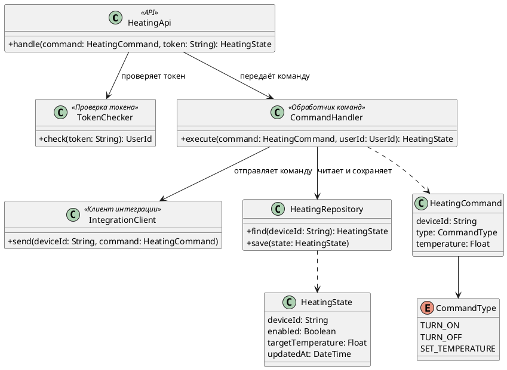

# Диаграмма кода

Классы сервиса отопления, которые выполняют команду пользователя. Освещение и ворота повторяют эту схему со своим типом команды.

```puml
@startuml
skinparam backgroundColor #FFFFFF
skinparam shadowing false
skinparam classAttributeIconSize 0

class HeatingApi <<API>> {
  +handle(command: HeatingCommand, token: String): HeatingState
}

class TokenChecker <<Проверка токена>> {
  +check(token: String): UserId
}

class CommandHandler <<Обработчик команд>> {
  +execute(command: HeatingCommand, userId: UserId): HeatingState
}

class IntegrationClient <<Клиент интеграции>> {
  +send(deviceId: String, command: HeatingCommand)
}

class HeatingRepository {
  +find(deviceId: String): HeatingState
  +save(state: HeatingState)
}

class HeatingCommand {
  deviceId: String
  type: CommandType
  temperature: Float
}

enum CommandType {
  TURN_ON
  TURN_OFF
  SET_TEMPERATURE
}

class HeatingState {
  deviceId: String
  enabled: Boolean
  targetTemperature: Float
  updatedAt: DateTime
}

HeatingApi --> TokenChecker : проверяет токен
HeatingApi --> CommandHandler : передаёт команду
CommandHandler --> HeatingRepository : читает и сохраняет
CommandHandler --> IntegrationClient : отправляет команду
CommandHandler ..> HeatingCommand
HeatingCommand --> CommandType
HeatingRepository ..> HeatingState

@enduml
```
