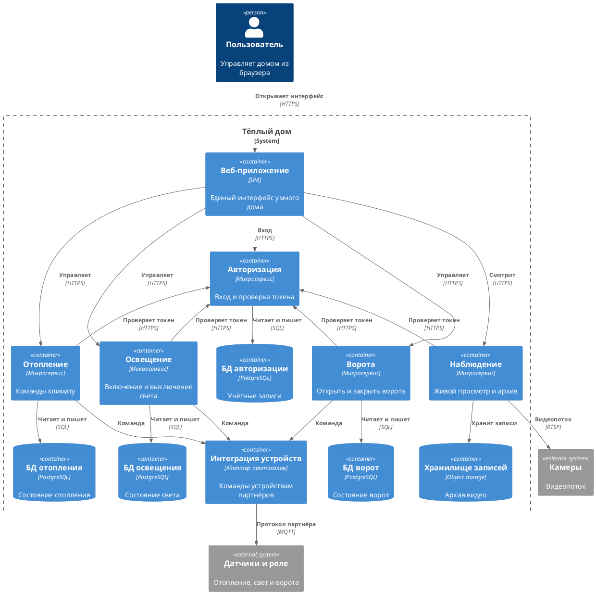

# Диаграмма контейнеров

```puml
@startuml
!include <C4/C4_Container>
skinparam backgroundColor #FFFFFF
skinparam nodesep 40
skinparam ranksep 40
LAYOUT_TOP_DOWN()

Person(user, "Пользователь", "Управляет домом из браузера")

System_Boundary(warmhouse, "Тёплый дом") {
    Container(web, "Веб-приложение", "SPA", "Единый интерфейс умного дома")
    Container(auth, "Авторизация", "Микросервис", "Вход и проверка токена")
    ContainerDb(authDb, "БД авторизации", "PostgreSQL", "Учётные записи")

    Container(heating, "Отопление", "Микросервис", "Команды климату")
    Container(light, "Освещение", "Микросервис", "Включение и выключение света")
    Container(gates, "Ворота", "Микросервис", "Открыть и закрыть ворота")
    Container(video, "Наблюдение", "Микросервис", "Живой просмотр и архив")

    ContainerDb(heatingDb, "БД отопления", "PostgreSQL", "Состояние отопления")
    ContainerDb(lightDb, "БД освещения", "PostgreSQL", "Состояние света")
    ContainerDb(gatesDb, "БД ворот", "PostgreSQL", "Состояние ворот")
    ContainerDb(videoDb, "Хранилище записей", "Object storage", "Архив видео")

    Container(adapter, "Интеграция устройств", "Адаптер протоколов", "Команды устройствам партнёров")
}

System_Ext(devices, "Датчики и реле", "Отопление, свет и ворота")
System_Ext(cameras, "Камеры", "Видеопоток")

web -[hidden]r- auth
heating -[hidden]r- light
light -[hidden]r- gates
gates -[hidden]r- video
heatingDb -[hidden]r- lightDb
lightDb -[hidden]r- gatesDb
gatesDb -[hidden]r- videoDb

Rel(user, web, "Открывает интерфейс", "HTTPS")
Rel(web, auth, "Вход", "HTTPS")
Rel_Down(web, heating, "Управляет", "HTTPS")
Rel_Down(web, light, "Управляет", "HTTPS")
Rel_Down(web, gates, "Управляет", "HTTPS")
Rel_Down(web, video, "Смотрит", "HTTPS")

Rel_Up(heating, auth, "Проверяет токен", "HTTPS")
Rel_Up(light, auth, "Проверяет токен", "HTTPS")
Rel_Up(gates, auth, "Проверяет токен", "HTTPS")
Rel_Up(video, auth, "Проверяет токен", "HTTPS")

Rel_Down(auth, authDb, "Читает и пишет", "SQL")
Rel_Down(heating, heatingDb, "Читает и пишет", "SQL")
Rel_Down(light, lightDb, "Читает и пишет", "SQL")
Rel_Down(gates, gatesDb, "Читает и пишет", "SQL")
Rel_Down(video, videoDb, "Хранит записи")

Rel_Down(heating, adapter, "Команда")
Rel_Down(light, adapter, "Команда")
Rel_Down(gates, adapter, "Команда")
Rel(adapter, devices, "Протокол партнёра", "MQTT")
Rel(video, cameras, "Видеопоток", "RTSP")

@enduml
```
