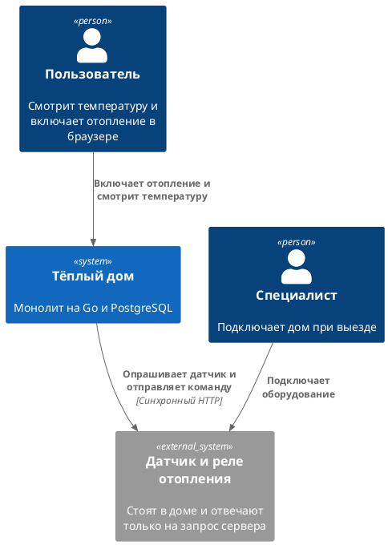

# Контекст системы

```puml
@startuml
!include <C4/C4_Context>
skinparam backgroundColor #FFFFFF

Person(user, "Пользователь", "Смотрит температуру и включает отопление в браузере")
Person(engineer, "Специалист", "Подключает дом при выезде")

System(warmhouse, "Тёплый дом", "Монолит на Go и PostgreSQL")

System_Ext(device, "Датчик и реле отопления", "Стоят в доме и отвечают только на запрос сервера")

Rel(user, warmhouse, "Включает отопление и смотрит температуру")
Rel(engineer, device, "Подключает оборудование")
Rel(warmhouse, device, "Опрашивает датчик и отправляет команду", "Синхронный HTTP")

@enduml
```
